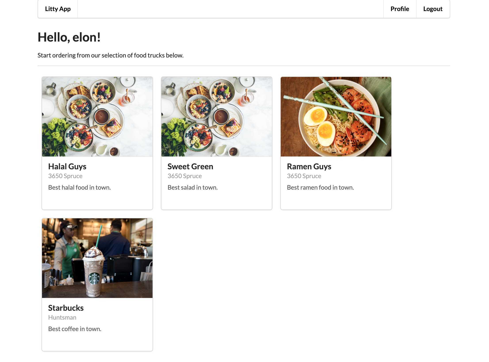
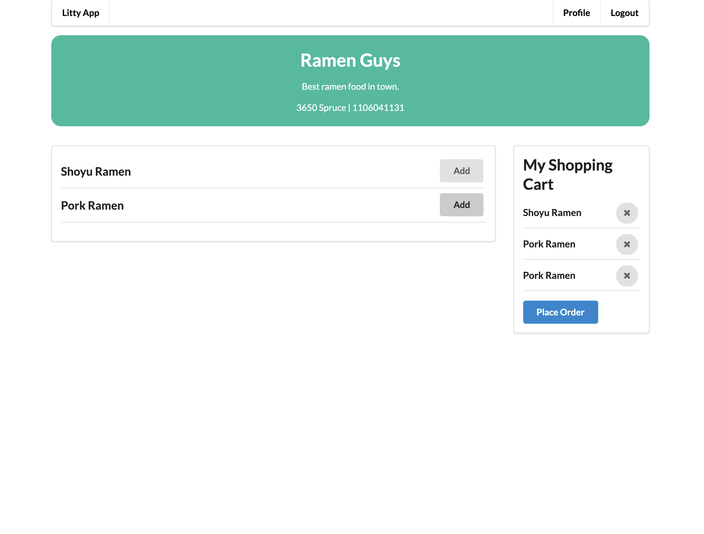

# Litty App

A webapp designed for food truck online ordering. Think Snackpass but for food trucks. As users, you can register an account, order from your favorite food truck, and pick it up using a unique pick up code. This app is built using the following technology: Django, React, Semantic UI, Webpack, Babel.

## Demos

Home Page:



Food Truck Menu:



## Setting Up

##### Initialize a virtual enviroment

Windows:

```
$ python3 -m venv venv
$ venv\Scripts\activate.bat
```

Unix/MacOS:

```
$ python3 -m venv venv
$ source venv/bin/activate
```

##### Install requirements

```
$ pip3 install -r requirements.txt
$ yarn install
```

#### Run Project in Development

```
$ yarn dev
$ cd littyapp
$ python3 manage.py migrate
$ python3 manage.py runserver
```
